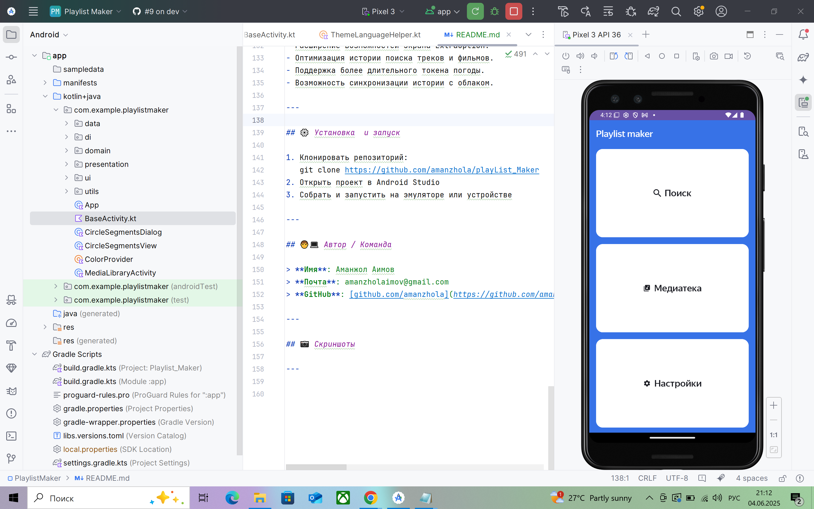
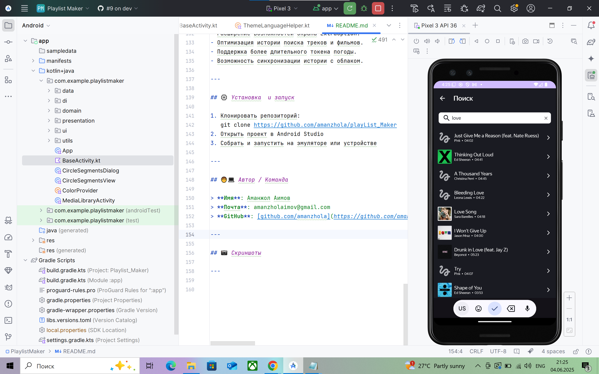
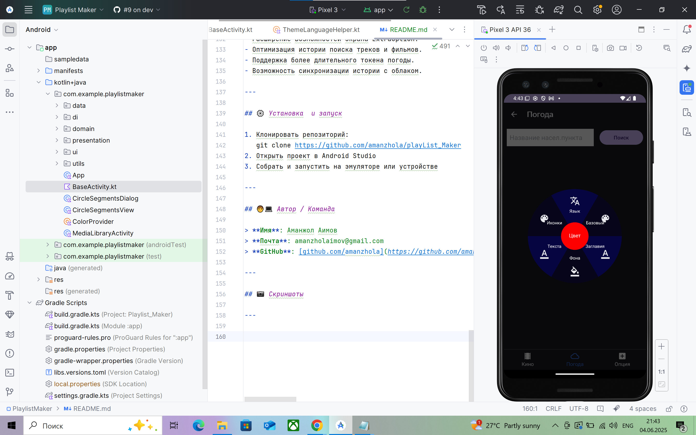

# 📱 Android Приложение с 6 Основными Экранами

## 📖 Описание

Это Android-приложение, сочетающее в себе музыкальный плеер, поиск фильмов, прогноз погоды и удобные пользовательские настройки. Основной упор сделан на кастомную навигацию, мультиязычность, адаптацию под требования ревьюеров и анимации переходов.
---

## 🏠 Главный экран

- Состоит из **6 кнопок** на весь экран (без `RecyclerView` или `ViewPager2`).
- Переключение между 2 наборами по 3 кнопки через **нажатие на заголовок**.
- **Тулбар** с `Dropdown`-меню (2 вложенных круга, переключение через нажатие на центр ➕ 🔄 круга).
- **На английской версии**:
    - Фильтр и Dropdown **открыты** ➕ добавлены 🙂 эмодзи для интуитивности 🌼.
- **На русской версии**:
    - 😌 Скрыты из-за ревьюеров (открываются при нажатии).
- **Переходы по кнопкам** — прямые (без `back stack`), возврат — на первую тройку кнопок.
- 6 вариантов **анимаций перехода между экранами**.
- **Нет нижней навигации** на главном экране 😕 (нижняя навигация его альтернатива).

---

## 🔽 🚗 Нижний навигатор

- Отображается на 6 внутренних экранах.
- Каждый экран — 3 кнопки навигации.
- Синий цвет — активный экран, нажатие на него открывает вторую тройку кнопок.
- Переходы **прямые**, без `stack`, и с кастомной анимацией.
- Кнопка "назад" в тулбаре возвращает на первый набор по 3 кнопки из главного меню.

---

## 🔍 Экран Поиска (Треки)

- Хранит историю последних **10 треков** ➕ обновление на верх строки в списке если трек уже есть в истории.
- При переходе на трек — показывается **горизонтальный скрол** всех треков из результата поиска.
- При клике — переключение на **вертикальный скрол** (если треков >1).
- Горизонтальный и вертикальные скролы реализованы на базе RecyclerView альтернатива на базе ViewPager2 в экране Кино
- Удаление треков из истории и списка — по **нажатию на стрелку**.
- Варианты отображения:
    - Верхний тулбар (всегда).
    - Нижний навигатор (если список пуст, скажем переход из главного экрана).
    - Альтернтивной исполнение: Автоматическая прозрачность на экране "Кино" при не пустом списке.
- Переход на **экран `ExtraOption`**:
    - Расширенные опции: смена темы, поделиться треком (в просмотре отдельного экрана) или треками(с экрана поиска если история > 0).
    - При отправке трек уходит с именем исполнителя и названием трека.
    - При получении 🎵 трека или 🎶 треков также поддреживается как вертикальный так и горизонтальный скол
    - Включении трека работает 🕒 трека и кнопки play, pause, favorite
    - Просмотр отдельного трека также как и в экране поиска реализована на sw320dp, sw360dp, sw393dp
    - В экране поиска длина названия или исполнителя трека ограничена в одну строку, тогда как при отдельном просмотре 0 ограничений
- Поддержка переключения темы, шаринга трека или треков, смены цветов в экране, доступ на все функции настроек и прочее прямо с тулбара.
- DropDown тулбара в виде вложенных кругов вращаются относительно центрального круга для расширения списка
- Переворот списка (reverse scroll) — по фильтру тулбара.

---

## 🎞️ Экран Кино

- Поиск фильмов:
    - Кнопка старта как альтернатива экрану поиска Песен.
    - Автостарт реализован (и закомментирован в коде).
- Результаты поиска при переходе на трек:
    - ViewPager2 с **горизонтальным скролом** (по умолчанию).
    - Переключение на **вертикальный скрол** — по кнопке.
- Верхний тулбар и нижний навигатор доступны.
- Деление фильмов на избранные (❤️).
- При поиске обьединяются и выдаются результы двух режимов поиска:
    - **Обычный** — имена актёров.
    - **Расширенный** — краткое описание фильма.
- При отдельном просмотре фильма как альтернатива экрану поиска песен — **нет тулбара** и **нет нижнего навигатора**.
- Переворот списка (reverse scroll) — по фильтру.
- ✨📽️💃 Шаринг кинофильма при просмотре в режиме просмотра постера фильма
- Получение кинофильма и распознавание если она в вашем списке избранных

---

## 🌦️ Экран Погоды

- Получение данных с Foreca API.
- Возможны ошибки ("Token Expired"), так как токен действует 30 дней.
- Верхний тулбар и нижний навигатор доступны.
- Переключение темы и поддержка всех стандартных функций тулбара.

---

## ⚙️ Экран Настроек

- Смена темы (глобально или через тулбар).
- Соглашение 📝, поддержка 🐶, поделиться 💌 — доступны через тулбар (`BaseActivity`).
- Нижний навигатор для перехода к другим экранам.
- Обработка ошибок:
    - При ошибке (например, нет интернета) —> сообщение на экране на 3 секунды.
    - После — рекурсивный откат к начальному состоянию.

---

## 💠 Экран ExtraOption

- Используется:
    - Как пустой шаблон при прямом переходе с главного экрана или с нижнего навигатора.
    - Как **контейнер опций** при переходе из экрана Поиска.
- Отображает тулбар и доступ к теме, делиться и другим действиям.
- Поддерживает переход между горизонтальным и вертикальным скролом.

---

## 🛠️ Технические особенности

- Кастомные анимации переходов между экранами (6 видов).
- Реализация `Dropdown` через вложенные вращающие круги.
- Переключение языка и видимости UI в зависимости от локали.
- Прямые переходы (без стека), максимально быстрый отклик и удаление блуждания при длинных переходах.
- Удобный тулбар через `BaseActivity`.
- В каждом экране реализован сообщение на отсутсвии интернета экран очищается для показа ошибки на 3 секунды и затем все обратно 

## ✌️ Стек технологий

 * Kotlin
 * Android SDK
 * ViewModel + LiveData
 * Coroutines
 * Retrofit
 * Koin (DI)
 * ViewPager2
 * RecyclerView
 * SharedPreferences

---

## 🚀 Будущие доработки

- Расширение возможностей экрана ExtraOption.
- Оптимизация истории поиска треков и фильмов.
- Поддержка более длительного токена погоды.
- Возможность синхронизации истории с облаком.

---

## ⚙️ Установка  и запуск

1. Клонировать репозиторий:
   git clone https://github.com/amanzhola/playList_Maker
2. Открыть проект в Android Studio
3. Собрать и запустить на эмуляторе или устройстве

---

## 🧑‍💻 Автор / Команда

> **Имя**: Аманжол Аимов
> **Почта**: amanzholaimov@gmail.com  
> **GitHub**: [github.com/amanzhola](https://github.com/amanzhola)

---

## 📷 Скриншоты

### 🏠 Главный экран

### 🔎 Экран Поиска

### ✨📽️💃 Экран Кино

### 🌧️ ☀️ ⛅ 🌩️ ❄️ Экран Погода 

### ⚙️ Настройки
.png)

### 🌼 Тулбар(dropdown)
.png)

---

